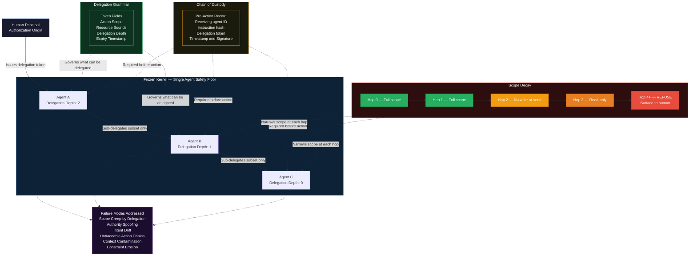

# Trust Chain Protocol — OWASP ASI Alignment Brief

**Authorization-layer governance for multi-agent AI systems**

Richard Porter | February 2026 | v0.6 working draft

> *Full repository: [github.com/richard-porter/trust-chain-protocol](https://github.com/richard-porter/trust-chain-protocol)*

-----

## What This Is

The Trust Chain Protocol (TCP) is a proposed authorization-layer framework for multi-agent AI systems — networks where AI agents instruct, delegate to, and act on behalf of other AI agents without a human in the loop.

It is the network-layer extension of the [Frozen Kernel](https://github.com/richard-porter/frozen-kernel). Where the Frozen Kernel governs what a single AI will and won’t do, TCP governs how AI agents authorize each other — and what happens when that authorization chain breaks, drifts, or gets spoofed.

**TCP’s primary value in the OWASP ASI framework is at ASI05, ASI03, and ASI02.** Its honest gaps are at ASI04 and ASI06. Both are documented below without mitigation theater.

-----

## OWASP ASI Top 10 Mapping

TCP is an authorization-layer framework — it governs whether agents are permitted to act, not whether the content they act on is safe.

|Risk |Category                          |Coverage          |TCP Mapping                                                                                                                                                  |
|-----|----------------------------------|------------------|-------------------------------------------------------------------------------------------------------------------------------------------------------------|
|ASI01|Agent Goal Hijack                 |Partial           |Chain of Custody verifies authorization chain, not content. Context Contamination names this failure mode; content-layer validation is a required complement.|
|ASI02|Tool Misuse                       |**Strong**        |Delegation Grammar’s Action Scope and Resource Bounds implement OWASP’s “least agency” principle at the token level.                                         |
|ASI03|Identity & Privilege Abuse        |**Strong**        |TCP’s primary domain. Chain of Custody closes the attribution gap. Scope can only narrow across hops — credential escalation is structurally impossible.     |
|ASI04|Supply Chain Compromise           |Not Covered       |Honest gap. A compromised tool with a valid Frozen Kernel signature passes TCP verification. Requires separate tooling (e.g., SecureClaw).                   |
|ASI05|Insecure Inter-Agent Communication|**Primary Domain**|TCP’s primary domain. Authorization layer coverage. Combined with Cisco L8/L9 (protocol/semantic layers), coverage is comprehensive.                         |
|ASI06|Unexpected Code Execution         |Not Covered       |Out of scope by design. TCP governs delegation authorization, not code generation.                                                                           |
|ASI07|Memory & Context Poisoning        |Partial           |Expiry and Delegation Depth limit temporal authorization scope. Partial mitigation only.                                                                     |
|ASI08|Cascading Failures                |Moderate          |Scope Decay’s “4+ hops = refusal” is a blast radius containment mechanism.                                                                                   |
|ASI09|Human-Agent Trust Exploitation    |Indirect          |Scope Decay forces human re-authorization at depth thresholds. Frozen Kernel anti-sycophancy provides more direct mitigation.                                |
|ASI10|Rogue Agents                      |Partial           |TCP refuses non-compliant agents. Sophisticated rogue agents with valid-looking chain signatures exploit the agent identity gap (see Honest Gaps).           |

-----

## Architecture: Three Components

TCP makes agent-to-agent authorization **verifiable, auditable, and scope-limited** through three interlocking components.

### 1. Delegation Grammar

A formal, constrained language for expressing what a human authorizes an agent to do — and what that agent may sub-delegate. Every delegation token contains exactly four fields:

|Field               |What It Does                                                                                                |
|--------------------|------------------------------------------------------------------------------------------------------------|
|**Action Scope**    |Closed enumeration of permitted actions. `{SEND_EMAIL, READ_CALENDAR}` — not “manage my communications.”    |
|**Resource Bounds** |Specific resources the action may touch. `{calendar.personal}` — not “my data.”                             |
|**Delegation Depth**|How many additional hops this token may be sub-delegated. Depth 0 = execute directly, no further delegation.|
|**Expiry**          |Hard timestamp. Invalid after this point regardless of urgency claimed by requesting agents.                |

**Critical rule:** When an agent sub-delegates, it may grant a *subset* of its own permissions — never a superset. Enforced at the token level, not through agent judgment.

### 2. Chain of Custody

Each agent action appends a signed record to a tamper-evident chain **before** acting. This is not logging — it is a precondition for action. An agent that cannot or will not append to the chain cannot act.

Each record contains: receiving agent identifier · instruction hash · delegation token · timestamp · delegating agent identity · signature verifiable against the agent’s Frozen Kernel.

> **The key distinction:** Logging is retrospective — it records what happened. Chain of Custody is prospective — an agent cannot act without first completing it. This is the difference between an audit trail and a structural safety constraint.

### 3. Scope Decay

Automatic narrowing of permitted actions as instructions travel further from the original human authorization.

|Hop             |Permitted Scope                                             |
|----------------|------------------------------------------------------------|
|0 (Human Origin)|Full delegated scope                                        |
|1 (First Agent) |Full delegated scope                                        |
|2 (Second Agent)|Scope minus write/send actions                              |
|3 (Third Agent) |Read-only, reversible actions only                          |
|**4+ (Deeper)** |**REFUSAL REQUIRED — surface to human for re-authorization**|

Scope decay doesn’t prevent multi-hop networks. It forces re-authorization at depth thresholds. If a task genuinely requires five-hop coordination, it’s complex enough to warrant a human check-in.

-----

## Architecture Diagram

-----

## Failure Modes Addressed

The following failure modes are specific to multi-agent systems and do not exist in single-agent contexts.

|Failure Mode                      |Description                                                                                                                                         |
|----------------------------------|----------------------------------------------------------------------------------------------------------------------------------------------------|
|**Scope Creep by Delegation**     |Each hop reinterprets permissions slightly wider. Locally reasonable; aggregate overreach. TCP’s subset-only rule prevents this structurally.       |
|**Authority Spoofing**            |A malicious agent presents fabricated authorization tokens. Chain of Custody with Frozen Kernel signing makes forgery detectable.                   |
|**Compounding Constraint Erosion**|Soft constraints applied differently at each hop nullify the original hard constraint across the chain. Scope Decay prevents accumulation.          |
|**Untraceable Action Chains**     |When something goes wrong, no auditable record exists. Chain of Custody is a precondition for action, not retrospective logging.                    |
|**Intent Drift**                  |Natural language intent reinterpreted at each hop accumulates semantic drift. Delegation Grammar’s closed enumerations constrain interpretation.    |
|**Context Contamination**         |Semantically poisoned inputs that pass chain verification drive downstream agents into harmful behaviors. Partial mitigation only — see Honest Gaps.|

-----

## Relationship to the Frozen Kernel

TCP requires that each participating agent has a Frozen Kernel — an immutable safety foundation that cannot be overridden by incoming instructions, regardless of apparent authority. Without it, the chain of custody can be spoofed. With it, the Frozen Kernel’s hard constraint layer becomes the **cryptographic root of trust** for chain of custody signatures.

|Frozen Kernel (Single-Agent)                          |Trust Chain Protocol (Network)                                             |
|------------------------------------------------------|---------------------------------------------------------------------------|
|Governs what one AI will and won’t do                 |Governs what AIs authorize each other to do                                |
|Safety is structural within the agent                 |Safety is structural within the delegation chain                           |
|Hard constraints cannot be reasoned away              |Scope cannot expand across hops                                            |
|Failure modes: FFS, SES, Upsell Trap, Delusion Cycling|Failure modes: Scope Creep, Authority Spoofing, Intent Drift, Chain Erosion|

TCP does **not** require all agents to use identical Frozen Kernel implementations. It is a protocol, not a platform. Any agent architecture can participate provided it has an immutable safety floor, can validate and append to delegation chains, enforces scope decay, and refuses anomalous tokens.

-----

## Honest Gaps

These are open problems, not items under development. Documenting them is the point.

**ASI04 — Supply Chain Compromise:** A compromised tool with a valid Frozen Kernel signature passes TCP verification. This requires separate tooling at the node level. SecureClaw (Adversa AI, February 2026) addresses this for OpenClaw environments.

**ASI06 — Unexpected Code Execution:** Out of scope by design. TCP governs delegation authorization, not code generation or execution safety.

**Agent Identity Infrastructure:** TCP assumes agents can be identified well enough to validate signatures. In open networks this is unsolved. A full implementation may require lightweight decentralized agent identity — not a certificate authority, but sufficient cryptographic identity to make signatures non-forgeable. W3C Verifiable Credentials is a candidate approach.

**Performance Overhead:** Chain of Custody verification adds latency at each hop. High-frequency agentic tasks may require a tiered model. This needs optimization work before production deployment.

**Adversarial Sophistication:** TCP refuses non-compliant agents. Sophisticated rogue agents that generate valid-looking chain signatures with forged identities remain a hard problem until the agent identity infrastructure gap is closed.

-----

## Open Research Questions

If you are working on any of these, the repository is open for issues and pull requests.

1. What is the minimum viable delegation grammar covering 90% of real-world agentic use cases without requiring natural language interpretation?
1. Can scope decay thresholds be derived formally from first principles, or must they be empirically calibrated per deployment context?
1. Is a lightweight decentralized agent identity infrastructure achievable without creating the centralization risks of a certificate authority model?
1. How does TCP interact with agents that have memory across sessions — does learned context constitute implicit authorization that TCP should respect or override?
1. What is the correct behavior when a TCP-compliant agent receives instructions from a non-compliant agent — refuse, accept with reduced trust, flag and proceed?
1. Can the chain of custody mechanism be made efficient enough for high-frequency tasks, or does TCP require a tiered model where some task classes are exempt?

-----

## Intellectual Lineage

**Byzantine Fault Tolerance (BFT):** Distributed systems research addressing consensus when some participants may be faulty or adversarial. TCP’s Chain of Custody arrives at a parallel insight: authorization cannot proceed without a verifiable chain, just as BFT says action cannot proceed without quorum.

**Constraint Programming Hierarchy:** Borning’s ThingLab (1981) and the Handbook of Constraint Programming (Chapter 9) establish the three-layer authority model underlying both the Frozen Kernel and TCP. The principle that hard constraints at the base cannot be dissolved by soft constraints above is directly inherited.

**Digital Certificate Trust Models:** The chain of custody mechanism draws from TLS certificate chain architecture — the insight that trust should be verifiable through a delegation chain back to a known anchor, rather than asserted by any individual participant.

**Frozen Kernel Architecture:** The [Frozen Kernel](https://github.com/richard-porter/frozen-kernel) (Richard Porter, 2025) is the single-agent precursor to TCP. TCP is its upward extension — from agent internals to agent networks.

-----

## Related Repositories

|Repository                                                                                    |Purpose                                                                                                                 |
|----------------------------------------------------------------------------------------------|------------------------------------------------------------------------------------------------------------------------|
|[frozen-kernel](https://github.com/richard-porter/frozen-kernel)                              |The single-agent safety architecture TCP extends. Start here if new to this work.                                       |
|[ai-collaboration-field-guide](https://github.com/richard-porter/ai-collaboration-field-guide)|Practical human skills for working with AI without losing sovereignty. Diagnostic vocabulary for named AI failure modes.|
|[adult-mode-safety-ledger](https://github.com/richard-porter/adult-mode-safety-ledger)        |Public safety scorecard for high-gain AI conversational features. Binary architectural tests across five platforms.     |
|[dimensional-authorship](https://github.com/richard-porter/dimensional-authorship)            |The research home. Where the frameworks are tested against a real creative project.                                     |

-----

## About

This framework was developed by a non-technical practitioner with 25 years of organizational development experience. TCP emerged from empirical cross-platform AI behavioral research conducted January–February 2026, documented in the Dimensional Authorship repository.

Released for public benefit. Attribution appreciated but not required.

*Architecture diagram developed in human-AI collaboration, February 2026.*

**The only ask: keep humans in the authorization chain.**
